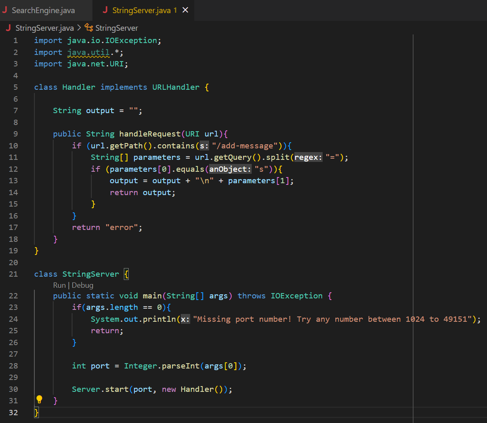
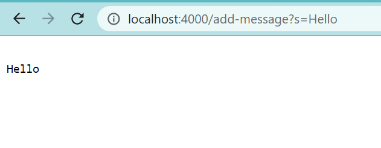
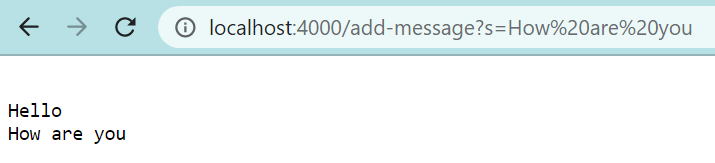
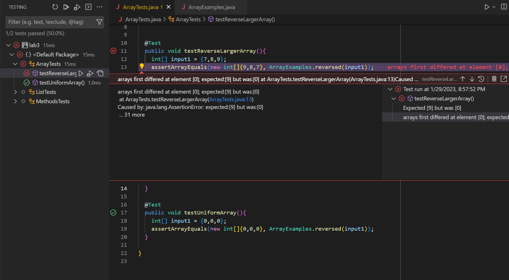

# Lab Report 2
### Part 1



The method ```handleRequest(URI url)``` is called, and relative URL ```/add-message?s=Hello``` is passed in as the URI argument. As for relevant fields in the method, ```url.getPath()``` checks if ```/add-message``` is in the path. In this case, the path is indeed ```/add-message```. The query is ```s=Hello```, and ```parameters[0]``` is set to ```s``` while ```parameters[1]``` is set to ```Hello```. ```Parameters[1]``` is then added to ```output```, and ```output``` is returned, which displays ```Hello on the screen```.

The method ```handleRequest(URI url)``` is called, and relative URL ```/add-message?s=How are you``` is passed in as the URI argument. As for relevant fields in the method, ```url.getPath()``` checks if ```/add-message``` is in the path. In this case, the path is indeed ```/add-message```. The query is ```s=How are you```, and ```parameters[0]``` is set to ```s``` while ```parameters[1]``` is set to ```How are you```. ```Parameters[1]``` is then added to ```output```, and ```output``` is returned, which displays:
```
Hello
How are you
```

### Part 2
I will discuss the bug in the `reversed(int[] arr)` method, which should return a new array with all the elements of the input array in reversed order.

**Failure-Inducing input**
```
int[] input1 = {7,8,9};
assertArrayEquals(new int[]{9,8,7}, ArrayExamples.reversed(input1));
```
**Non-failure inducing input**
```
int[] input1 = {0,0,0};
assertArrayEquals(new int[]{0,0,0}, ArrayExamples.reversed(input1));
```
**The Symptom**


**The Bug**
*Before*
```
  // Returns a *new* array with all the elements of the input array in         reversed order
  static int[] reversed(int[] arr) {
    int[] newArray = new int[arr.length];
    for(int i = 0; i < arr.length; i += 1) {
      arr[i] = newArray[arr.length - i - 1];
    }
    return arr;
  }
```
The bug is that the new array’s values (which are all initialized with 0) are being set to the original array instead of vice-versa. Correcting this correctly returns a new array in reverse order.
*After*
```
  // Returns a *new* array with all the elements of the input array in         reversed order
  static int[] reversed(int[] arr) {
    int[] newArray = new int[arr.length];
    for(int i = 0; i < arr.length; i += 1) {
      newArray[i] = arr[arr.length - i - 1];
    }
    return newArray;
  }
```

###Part 3
The stuff about hosting servers using Java was new to me and really interesting! I hadn't known about the java.net package or any of its methods previously. It got me thinking about all sorts of applications for those techniques, especially to help me create small personal projects such as an improved version of When2Meet. 


