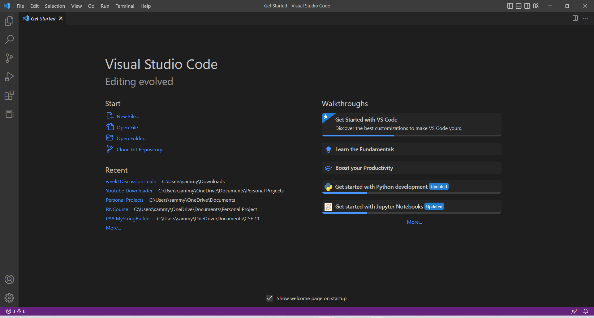
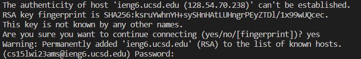
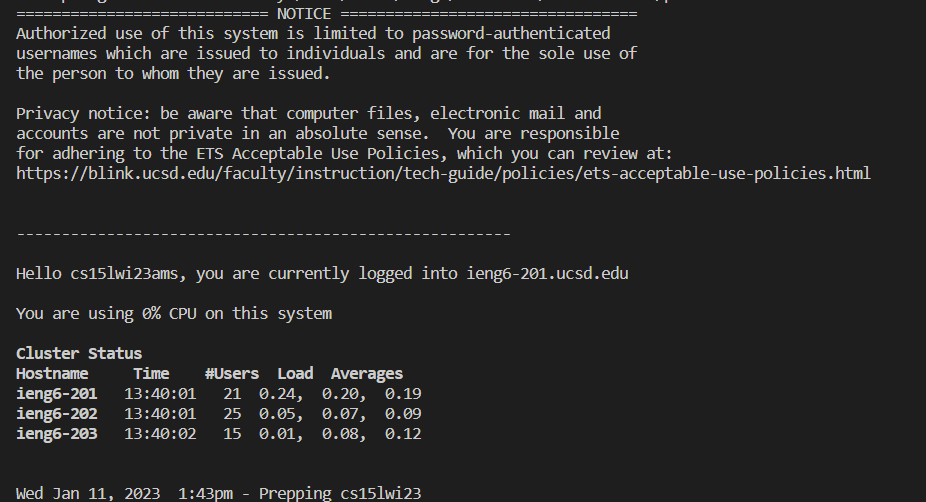
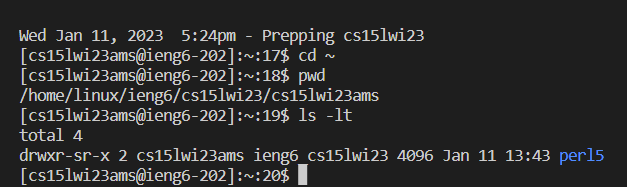

# Week 1 Lab Report
## SSH log-in tutorial 

### Step 1: Find CSE15L Account
Use [the account-lookup website](https://sdacs.ucsd.edu/~icc/index.php) to find your course-specific username and reset the password

### Step 2: Download Visual Studio Code
Download Visual Studio Code from [the web](https://code.visualstudio.com/).
After following the installer's instructions, you should be able to open VSCode. It should look something
like the following screenshot.



### Step 3: Download Git and setup terminal
Download Git from [the web](https://gitforwindows.org/)
Then setup Bash for VSCode by following [this tutorial](https://stackoverflow.com/questions/42606837/how-do-i-use-bash-on-windows-from-the-visual-studio-code-integrated-terminal/50527994#50527994)

### Step 4: Remotely connecting
To connect to a server using ssh, open a new terminal in VSCode and paste the following command, replacing zzz with the last three digits of your username.

```$ ssh cs15lwi23zzz@ieng6.ucsd.edu```

You should see a message like the following:



Enter yes, and then input your password. Then, if you've succesfully connected to the server (another computer), you should see a message like the following:



### Step 5: Running commands
Now that your computer (the client) is connected to the server, you can run commands from your computer that will run in the server.
Some commands you can try are:
- `cd`
- `ls`
- `ls \-a`
- `ls -lat`
- `pwd`


For instance, the above sequence of commands first changes directory to the home directory. The `pwd` command then prints the path of the working directory from the root. The `ls -lt` command lists the files in the directory; the `-l` provides a more detailed listing of the files while the `-t` lists the files in the order they were modified.

Keep playing around with the commands, and have fun!
